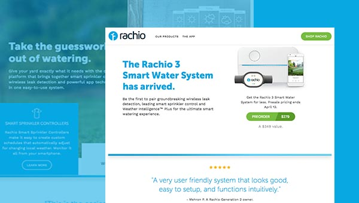

[Bloc Jams](https://bloc-jams-angularjs.herokuapp.com/album)  was the first site I developed during my time at [Bloc](https://www.bloc.io/frontend-development-bootcamp). Since the focus was on functionality, all designs and content were premade (although every time I look back at the design I get an urge to re-design it). The main focus was on creating a working music player and I developed the functionality 2 different times. First I used a mix of vanilla JS and Jquery, and then I refactored it with Angular JS. Code for the [Jquery version](https://github.com/EricSSartorius/bloc-jams) or [AngularJS version](https://github.com/EricSSartorius/bloc-jams-angular) can be found on Github.